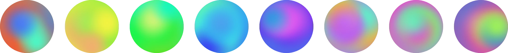
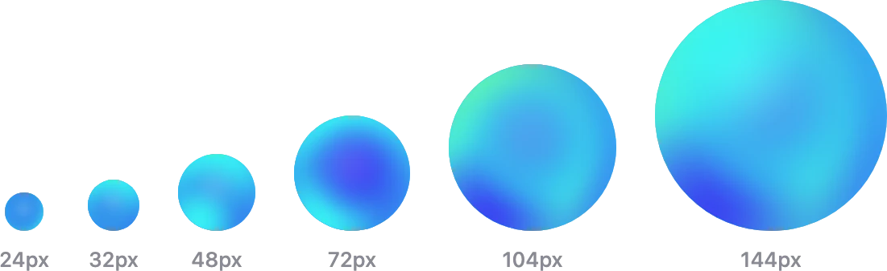
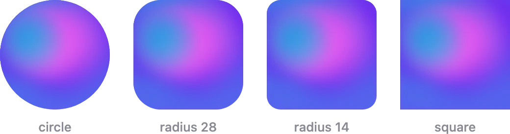

# Guuli

Deterministic gradient avatars for React Native and Expo.

Give it a user ID, an email, or a wallet address — it paints a unique mesh
gradient. The same seed always produces the same avatar, so there's nothing to
store, upload, or fetch.

```tsx
import { GradientAvatar } from "guuli";

<GradientAvatar seed={user.id} size={40} />
```



## Install

**Expo**

```sh
npx expo install guuli react-native-svg
```

**Bare React Native**

```sh
npm install guuli react-native-svg
cd ios && pod install
```

Android autolinks — no extra step. If your app already uses `react-native-svg`,
you only need `guuli`.

## Blockchain addresses

Works with EVM, Solana and Bitcoin addresses, and with ENS names. Wrap the
value in `seedForAddress` and one account gets one avatar, whatever form it
arrives in:

```tsx
import { seedForAddress } from "guuli/crypto";

<GradientAvatar seed={seedForAddress(account.address)} size={40} />
```

Without it, the same account can render several different avatars — your UI
shows EIP-55 checksummed hex, your API returns lowercase, a QR code encodes
bech32 in uppercase.

| | Example | Handling |
|---|---|---|
| **EVM** — Ethereum, Polygon, Arbitrum, Base… | `0xd8dA6BF2…` | Case-insensitive, so it's lowercased. Covers tx and block hashes too. |
| **Bitcoin** — bech32 and taproot | `bc1qw508…` `bc1p0xlx…` | Case-insensitive per BIP-173; lowercased. |
| **Bitcoin** — legacy P2PKH and P2SH | `1A1zP1eP…` `3J98t1Wp…` | base58, where case carries meaning — left untouched. |
| **Solana** | `7xKXtg2CW…` | base58 — left untouched. |
| **ENS** | `vitalik.eth` `pay.vitalik.eth` | Lowercased, since ENS resolves names case-insensitively. |
| Anything else | a user ID, a username | Left untouched. |

Unrecognised input comes back unchanged, so it's always safe to call and never
throws. An address is one identity across chains — the same avatar on Ethereum,
Polygon and Arbitrum.

Two things worth knowing:

- **Prefer the address over the ENS name** where you have it. A name is a label
  on an account, not the account — it can change hands, and an expired name
  re-registered by someone else would carry the avatar to them.
- **Unicode ENS names** (emoji, non-ASCII) are left untouched. Matching them
  properly needs the full ENSIP-15 confusable tables, which would cost more
  than this whole package. Not merging is the safe direction.

## Sizes

Small avatars are drawn with fewer, larger shapes so they stay legible instead
of turning to mud. The `size` prop handles it; there's nothing to configure.



## Shapes



```tsx
<GradientAvatar seed="wallet" size={112} />             {/* circle (default) */}
<GradientAvatar seed="wallet" size={112} radius={28} /> {/* rounded square */}
<GradientAvatar seed="wallet" size={112} radius={0} />  {/* square */}
```

## License

[MIT](./LICENSE)
