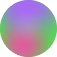
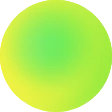

# Guuli

Deterministic gradient avatars for React Native and Expo.

Give it a user ID, an email, or a wallet address — it paints a unique mesh
gradient. The same seed always produces the same avatar, so there's nothing to
store, upload, or fetch.

```tsx
import { GradientAvatar } from "guuli";

<GradientAvatar seed={user.id} size={40} />
```


## Install

**Expo**

```sh
npx expo install guuli react-native-svg
```

**Bare React Native**

```sh
npm install guuli react-native-svg
cd ios && pod install
```

Android autolinks — no extra step. If your app already uses `react-native-svg`,
you only need `guuli`.

## Blockchain addresses

Supports **EVM** (Ethereum, Polygon, Arbitrum, Base, BNB Chain), **Solana** and
**Bitcoin**.

Wrap the address in `seedForAddress` so one account always gets one avatar —
your UI shows checksummed hex, your API returns lowercase, a QR code encodes
bech32 in uppercase, and all three should look identical:

```tsx
import { seedForAddress } from "guuli/crypto";

<GradientAvatar seed={seedForAddress(account.address)} size={40} />
```

| | Chain | Example |
|:--:|---|---|
|  | EVM | `0xd8dA6BF26964aF9D7eEd9e03E53415D37aA96045` |
|  | Solana | `7xKXtg2CW87d97TXJSDpbD5jBkheTqA83TZRuJosgAsU` |
|  | Bitcoin — bech32, taproot, legacy | `bc1qw508d6qejxtdg4y5r3zarvary0c5xw7kv8f3t4` |

Anything else passes through unchanged, so it's always safe to call.

## Sizes

Small avatars are drawn with fewer, larger shapes so they stay legible instead
of turning to mud. The `size` prop handles it; there's nothing to configure.


## Shapes


```tsx
<GradientAvatar seed="wallet" size={112} />             {/* circle (default) */}
<GradientAvatar seed="wallet" size={112} radius={28} /> {/* rounded square */}
<GradientAvatar seed="wallet" size={112} radius={0} />  {/* square */}
```

## License

[MIT](./LICENSE)
